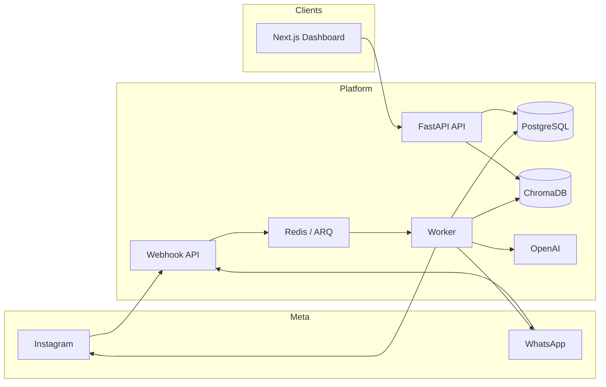

# Rootellect Instagram AI Automation

Production-grade monorepo for **Rootellect's** AI-powered Instagram and WhatsApp marketing automation platform. The system ingests Meta webhooks, runs an AI pipeline with RAG and moderation, executes outbound actions (public replies, DMs, WhatsApp), nurtures leads through funnels, and provides an operator dashboard for campaigns, knowledge, and analytics.

---

## Table of Contents

- [Features](#features)
- [Architecture](#architecture)
- [Repository Structure](#repository-structure)
- [Tech Stack](#tech-stack)
- [How It Works](#how-it-works)
- [Prerequisites](#prerequisites)
- [Quick Start (Local)](#quick-start-local)
- [Docker (Full Stack)](#docker-full-stack)
- [Environment Variables](#environment-variables)
- [Dashboard](#dashboard)
- [API Overview](#api-overview)
- [Webhooks](#webhooks)
- [Background Jobs](#background-jobs)
- [Seed Knowledge](#seed-knowledge)
- [Testing & CI](#testing--ci)
- [Deployment](#deployment)
- [Documentation](#documentation)
- [License](#license)

---

## Features

### Social automation

- **Instagram** — comment replies, private DMs, conversation threads, webhook logging
- **WhatsApp Cloud API** — inbound messages, AI replies, template support
- **Meta OAuth** — connect Facebook Page–backed Instagram or Professional Login from the dashboard
- **Provider modes** — `mock` (local dev), `instagram_professional`, `facebook_page_backed`

### AI pipeline

- **OpenAI** generation with deterministic fallback when no API key is set
- **Conversation-aware prompts** with campaign keyword matching
- **Chroma RAG** over knowledge base (markdown fallback if Chroma is unavailable)
- **Wellness segmentation**, intent analysis, lead scoring, confidence gating
- **Moderation** — safety flags, hide/reply decisions, audit logs

### Growth & retention

- **Campaigns** — keyword triggers, product focus, public reply / DM / WhatsApp toggles
- **Funnel engine** — multi-step nurture (e.g. IG DM → WhatsApp) with scheduled steps via ARQ cron
- **Retention jobs** — stale conversation recovery, scheduled touchpoints
- **Shopify** — cart abandonment webhooks and recovery flows (optional)

### Content & ops

- **Content studio API** — reels, stories, carousels, founder scripts
- **Knowledge CRUD** — admin-managed docs chunked and embedded for RAG
- **Real-time dashboard** — WebSocket events for live comment/AI activity
- **Security** — JWT auth, rate limiting, security headers, webhook signature validation (strict in production)

---

## Architecture



| Layer | Role |
|--------|------|
| **FastAPI (`api`)** | REST API, webhook ingress, WebSocket, Meta OAuth callbacks |
| **ARQ worker** | Async webhook processing, funnel steps, retention cron |
| **PostgreSQL** | Users, events, comments, conversations, leads, campaigns, funnels, orders |
| **Redis** | Job queue for ARQ |
| **ChromaDB** | Vector store for knowledge RAG |
| **Nginx** | Reverse proxy in Docker (port 8080) |
| **Next.js** | Operator dashboard (Vercel or local) |

---

## Repository Structure

```
Marketing Automation/
├── backend/                 # FastAPI application
│   ├── app/
│   │   ├── api/v1/          # REST routes (auth, campaigns, funnels, content, …)
│   │   ├── ai/              # Prompting, RAG, Chroma store
│   │   ├── core/            # Config, logging
│   │   ├── database/        # SQLAlchemy session & base
│   │   ├── models/          # ORM entities
│   │   ├── queues/          # ARQ worker & enqueue helpers
│   │   ├── services/        # Event processor, action engine, funnel runner, …
│   │   ├── webhooks/        # Meta Instagram & WhatsApp handlers
│   │   └── main.py          # App entrypoint
│   ├── alembic/             # Database migrations
│   └── tests/               # Unit & integration tests
├── frontend/                # Next.js 16 App Router dashboard
│   ├── app/(dashboard)/     # Overview, analytics, campaigns, funnels, …
│   ├── components/          # UI & dashboard shell
│   ├── services/api.ts      # Backend client
│   └── store/auth.ts        # JWT auth state
├── infra/nginx/             # Docker Nginx config
├── seed/knowledge/          # Sample markdown for knowledge base
├── docs/                    # API, deployment, security, Meta app review
├── docker-compose.yml       # Postgres, Redis, Chroma, API, worker, Nginx
├── .env.example             # Root env template (Docker Compose)
└── .github/workflows/       # CI (backend lint/test, frontend typecheck)
```

---

## Tech Stack

| Area | Technologies |
|------|----------------|
| Backend | Python 3.12, FastAPI, SQLAlchemy 2 (async), Alembic, ARQ, structlog |
| Database | PostgreSQL 17, asyncpg |
| Cache / queue | Redis 7 |
| Vectors | ChromaDB 0.6 |
| AI | OpenAI API (chat + embeddings) |
| Frontend | Next.js 16, React 19, TypeScript, Tailwind CSS 4, TanStack Query, Zustand |
| Infra | Docker Compose, Gunicorn, Nginx |

---

## How It Works

1. **Webhook received** — Meta sends Instagram/WhatsApp payloads to `/webhooks/meta/*`. Payload is logged, signature verified (production), and a job is enqueued to Redis.
2. **Worker processes event** — `event_processor` normalizes the payload into `SocialEvent`, `Comment`, or `Message` records.
3. **Campaign match** — Keywords and product focus from active campaigns are matched against comment/DM text.
4. **AI decision** — RAG retrieves relevant knowledge chunks; the model returns reply text, intent, confidence, and moderation flags.
5. **Action engine** — If confidence meets `AI_MIN_AUTOSEND_CONFIDENCE`, the provider adapter sends public reply, private DM, or WhatsApp message. All attempts are idempotent and logged.
6. **Lead & funnel** — Scores update; eligible leads enter funnel steps scheduled by cron (every 15 minutes).
7. **Dashboard** — Operators review comments, conversations, AI logs, moderation, and adjust campaigns/knowledge/settings.

---

## Prerequisites

- **Docker Desktop** (recommended) — Postgres, Redis, Chroma, API, worker
- **Python 3.12+** — local backend without full Compose
- **Node.js 20+** — frontend
- **Meta Developer App** — for production Instagram/WhatsApp (optional in `mock` mode)
- **OpenAI API key** — optional; fallback responses work without it

---

## Quick Start (Local)

### 1. Environment

```powershell
# From repo root (Docker services)
Copy-Item .env.example .env

# Or backend-only local overrides
Copy-Item backend\.env.example backend\.env
```

### 2. Infrastructure

```powershell
docker compose up -d postgres redis chroma
```

### 3. Backend

```powershell
cd backend
python -m venv .venv
.\.venv\Scripts\Activate.ps1
pip install -e ".[dev]"
alembic upgrade head
uvicorn app.main:app --reload
```

API: `http://localhost:8000`  
OpenAPI docs: `http://localhost:8000/api/v1/docs`

### 4. Bootstrap admin (once)

```powershell
Invoke-RestMethod -Method Post http://localhost:8000/api/v1/auth/bootstrap
```

Default credentials come from `ADMIN_EMAIL` / `ADMIN_PASSWORD` in `.env`.

### 5. Worker (separate terminal)

Webhooks and cron require the ARQ worker:

```powershell
cd backend
.\.venv\Scripts\Activate.ps1
arq app.queues.worker.WorkerSettings
```

### 6. Frontend

```powershell
cd frontend
Copy-Item .env.local.example .env.local
npm install
npm run dev
```

Dashboard: `http://localhost:3000`

Set `NEXT_PUBLIC_API_BASE_URL=http://localhost:8000/api/v1` in `frontend/.env.local` when using a local backend.

---

## Docker (Full Stack)

```powershell
Copy-Item .env.example .env
docker compose up --build
```

| Service | URL / port |
|---------|------------|
| API | `http://localhost:8000` |
| Chroma | `http://localhost:8001` |
| Nginx proxy | `http://localhost:8080` |
| Postgres | `localhost:5432` |
| Redis | `localhost:6379` |

Migrations run automatically on API container start. Bootstrap admin after services are healthy:

```powershell
Invoke-RestMethod -Method Post http://localhost:8000/api/v1/auth/bootstrap
```

---

## Environment Variables

### Root / Docker (`.env.example`)

| Variable | Description |
|----------|-------------|
| `ENVIRONMENT` | `local` or `production` (controls webhook signature strictness) |
| `DATABASE_URL` | Async PostgreSQL URL |
| `REDIS_URL` | ARQ queue |
| `CHROMA_HOST` / `CHROMA_PORT` | Vector DB |
| `JWT_SECRET_KEY` | Access token signing |
| `ENCRYPTION_SECRET` | Provider token encryption at rest |
| `PROVIDER_MODE` | `mock`, `instagram_professional`, `facebook_page_backed` |
| `META_*` | App ID, secret, OAuth redirect, verify token, scopes |
| `OPENAI_API_KEY` / `OPENAI_MODEL` | AI generation |
| `WHATSAPP_*` | Cloud API phone number ID and token |
| `SHOPIFY_*` | Optional cart recovery webhooks |

See `backend/.env.example` for the full backend list including `ADMIN_EMAIL`, `RESET_ADMIN_SECRET`, and tuning knobs.

### Frontend (`frontend/.env.local.example`)

| Variable | Description |
|----------|-------------|
| `NEXT_PUBLIC_API_BASE_URL` | Backend REST base |
| `BACKEND_API_BASE_URL` | Server-side API proxy target |
| `NEXT_PUBLIC_WS_URL` | WebSocket for live events |
| `NEXT_PUBLIC_PROVIDER_MODE` | Display / feature flags |
| `BACKEND_WEBHOOK_URL` | Optional Vercel → backend webhook forward |
| `META_VERIFY_TOKEN` | Must match Meta App Dashboard verify token |

---

## Dashboard

| Route | Purpose |
|-------|---------|
| `/` | Overview metrics & recent AI activity |
| `/analytics` | Charts and performance trends |
| `/comments` | Processed Instagram comments |
| `/conversations` | DM / WhatsApp threads |
| `/leads` | Lead CRM, scores, lifecycle |
| `/campaigns` | Keyword campaigns & automation rules |
| `/funnels` | Multi-step nurture funnels |
| `/content` | AI content generation studio |
| `/moderation` | Safety actions & flags |
| `/knowledge` | RAG knowledge base CRUD |
| `/webhooks` | Raw webhook delivery logs |
| `/settings` | Provider status, Meta connect, preferences |

Auth is JWT-based with middleware protecting dashboard routes.

---

## API Overview

Base path: **`/api/v1`**

| Group | Endpoints |
|-------|-----------|
| Auth | `POST /auth/bootstrap`, `POST /auth/login`, `GET /me` |
| Dashboard | `GET /dashboard/metrics` |
| Social | `GET /comments`, `GET /conversations`, `GET /conversations/{id}/messages` |
| CRM | `GET /leads`, `PATCH /leads/{id}`, `GET/POST /campaigns` |
| Funnels | `GET /funnels` |
| Content | `POST /content/generate` |
| Commerce | `POST /commerce/shopify/webhook` |
| AI & safety | `GET /ai-logs`, `GET /moderation`, `GET/POST /knowledge` |
| Meta | `GET /meta/connect-url`, OAuth callback, `POST /meta/sync/comments` |
| Settings | `GET /settings/providers` |
| Logs | `GET /webhooks/logs` |

Full reference: [docs/API.md](docs/API.md)

Other routes:

- `GET /health` — health check
- `WS /ws/events` — realtime dashboard events
- `GET/POST /webhooks/meta/instagram` — Meta Instagram
- `GET/POST /webhooks/meta/whatsapp` — Meta WhatsApp

---

## Webhooks

### Meta configuration

Register these URLs in the Meta App Dashboard:

```text
https://your-backend-domain.com/webhooks/meta/instagram
https://your-backend-domain.com/webhooks/meta/whatsapp
```

Subscribe to: `comments`, `messages` (Instagram); `messages` (WhatsApp).

`META_VERIFY_TOKEN` in `.env` must match the verify token in Meta.

### OAuth redirect (Instagram connect)

```text
https://your-backend-domain.com/api/v1/meta/callback
```

Example production Meta settings:

```env
META_APP_ID=your-meta-app-id
META_APP_SECRET=your-meta-app-secret
META_OAUTH_REDIRECT_URI=https://your-backend-domain.com/api/v1/meta/callback
META_CONNECT_SUCCESS_URL=https://your-frontend-domain.com/settings
PROVIDER_MODE=facebook_page_backed
```

### Local smoke test

```powershell
Invoke-RestMethod -Method Post http://localhost:8000/webhooks/meta/instagram `
  -ContentType 'application/json' `
  -Body '{"entry":[{"id":"rootellect","changes":[{"field":"comments","value":{"id":"comment_1","text":"Need price for Mind Calm","from":{"id":"user_1","username":"riya"},"media_id":"reel_1"}}]}]}'
```

In `ENVIRONMENT=local`, missing signatures are logged but not rejected. In production, invalid signatures return `401`.

---

## Background Jobs

| Job | Schedule / trigger |
|-----|-------------------|
| `process_webhook_job` | On each webhook POST |
| `process_due_funnel_steps` | Cron: every 15 minutes |
| `process_conversation_recovery` | Cron: 09:00, 15:00, 21:00 |
| `process_retention_touchpoints` | Cron: 10:30 daily |

Ensure the `worker` service (Docker) or `arq` process (local) is always running in production.

---

## Seed Knowledge

Markdown files in `seed/knowledge/` are intended for import into the knowledge base:

- `rootellect-products.md` — product catalog context
- `ingredient-education.md` — wellness ingredient facts
- `objection-handling.md` — sales objection responses
- `founder-voice.md` — brand tone and founder messaging
- `policies-shipping-refunds.md` — policy answers
- `safety-guardrails.md` — moderation boundaries

Use the dashboard **Knowledge** page or `POST /api/v1/knowledge` to load them.

---

## Testing & CI

### Backend

```powershell
cd backend
pip install -e ".[dev]"
ruff check app tests
pytest
```

### Frontend

```powershell
cd frontend
npm run lint
npm run typecheck
```

GitHub Actions (`.github/workflows/ci.yml`) runs backend lint/tests and frontend typecheck on `main` and pull requests.

---

## Deployment

Recommended layout:

- **Frontend** — Vercel (`frontend/`)
- **Backend** — VPS with Docker Compose (API, worker, Postgres, Redis, Chroma, Nginx)
- **DNS** — HTTPS to Nginx on the VPS

Production checklist, env template, and verification steps: **[docs/DEPLOYMENT.md](docs/DEPLOYMENT.md)**

Copy [`.env.production.example`](.env.production.example) on the VPS and set all secrets before `docker compose up -d --build`.

### Vercel frontend (webhook forwarding)

```env
BACKEND_WEBHOOK_URL=https://your-backend-domain.com/webhooks/meta/instagram
NEXT_PUBLIC_PROVIDER_MODE=facebook_page_backed
NEXT_PUBLIC_OPENAI_READY=true
NEXT_PUBLIC_WHATSAPP_READY=false
```

---

## Documentation

| Document | Contents |
|----------|----------|
| [docs/API.md](docs/API.md) | REST endpoint reference |
| [docs/DEPLOYMENT.md](docs/DEPLOYMENT.md) | VPS, Docker, Meta, Vercel setup |
| [docs/SECURITY.md](docs/SECURITY.md) | Auth, encryption, webhook security |
| [docs/META_APP_REVIEW.md](docs/META_APP_REVIEW.md) | Meta App Review guidance |

Interactive API docs (when API is running): `/api/v1/docs` and `/api/v1/redoc`.

---

## License

Proprietary — Rootellect. All rights reserved unless otherwise specified by the repository owner.
